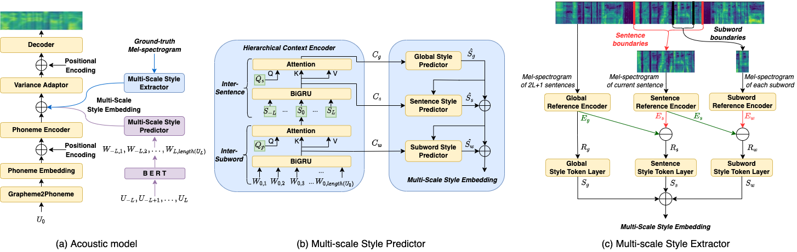
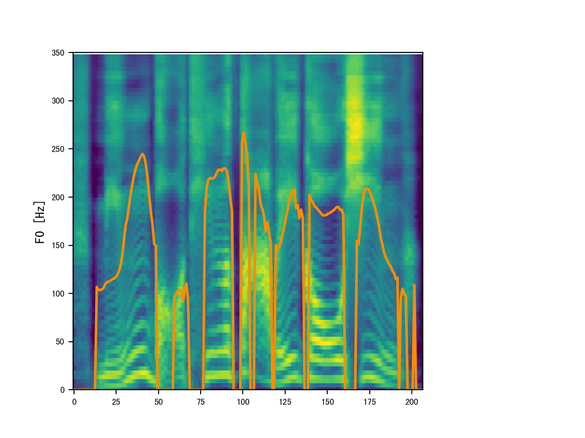
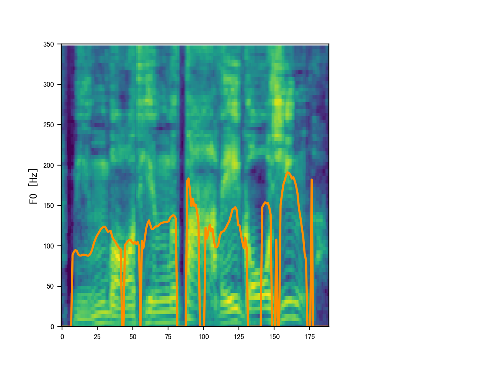
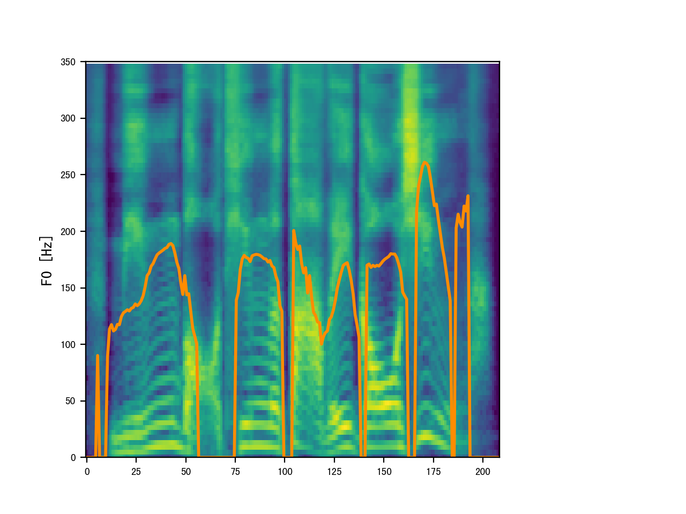
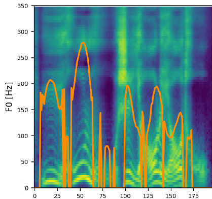
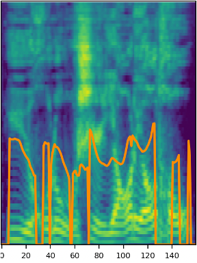

# Abstract

The Song Generation task aims to synthesize music composed of vocals and accompaniment from given lyrics. While the existing method, Jukebox, has explored this task, its constrained control over the generations often leads to deficiency in music performance. To mitigate the issue, we introduce an important concept from music composition, namely chords, to song generation networks. Chords form the foundation of accompaniment and provide vocal melody with associated harmony. Given the inaccuracy of automatic chord extractors, we devise a robust cross-attention mechanism augmented with dynamic weight sequence to integrate extracted chord information into song generations and reduce frame-level flaws, and propose a novel model termed Chord-Conditioned Song Generator (CSG) based on it. Experimental evidence demonstrates our proposed method outperforms other approaches in terms of musical performance and control precision of generated songs.

    
     
    
 Fig.1: The architecture of our proposed model. 

# Music Sample 
We show the songs generated by proposed CSG and other methods, conditioned by unseen lyrics and specified chords.

## S-MOS (in-domain)

| Lyrics | Chords | reference chords | proposed | Jukebox | GPT-only |concatenation | cross-attention |
| :----- | :----: | :--------------- | :------- | :------ | :------- | :----------- |  :------------- |
| But thoughts, the fields to see and prize; Else may the silent feet. | 6-5-4-1 (A:min-G:maj-F:maj-C:maj) | <audio controls><source src="./wavs/ref chords/6541.mp3" type="audio/mp3">Your browser does not support the audio element.</audio> | <audio controls><source src="./wavs/propose/6541.wav" type="audio/mp3">Your browser does not support the audio element.</audio> | <audio controls><source src="./wavs/jukebox/6541.mp3" type="audio/mp3">Your browser does not support the audio element.</audio> | <audio controls><source src="./wavs/gpt-only/6541.mp3" type="audio/mp3">Your browser does not support the audio element.</audio> | <audio controls><source src="./wavs/concatenation/6541.mp3" type="audio/mp3">Your browser does not support the audio element.</audio> | <audio controls><source src="./wavs/cross/6541.mp3" type="audio/mp3">Your browser does not support the audio element.</audio> |

## S-MOS (out-of-domain)

| Target Chinese Text                                          |                         FastSpeech 2                         | WSV*                                                         | HCE                                                          | MSStyleTTS                                                   |
| :----------------------------------------------------------- | :----------------------------------------------------------: | :----------------------------------------------------------- | :----------------------------------------------------------- | :----------------------------------------------------------- |
| 这把火终于烧起来了,而且是燎原之势。                          | <audio controls><source src="./wavs/smos/fs2/0.wav" type="audio/wav">Your browser does not support the audio element.</audio> | <audio controls><source src="./wavs/smos/wsv/0.wav" type="audio/wav">Your browser does not support the audio element.</audio> | <audio controls><source src="./wavs/smos/hce/0.wav" type="audio/wav">Your browser does not support the audio element.</audio> | <audio controls><source src="./wavs/smos/pro/0.wav" type="audio/wav">Your browser does not support the audio element.</audio> |
| 作为一个正常人,在做出一个可能会掉脑袋的决定的选择上,是绝对不会如此轻率的。 | <audio controls><source src="./wavs/smos/fs2/1.wav" type="audio/wav">Your browser does not support the audio element.</audio> | <audio controls><source src="./wavs/smos/wsv/1.wav" type="audio/wav">Your browser does not support the audio element.</audio> | <audio controls><source src="./wavs/smos/hce/1.wav" type="audio/wav">Your browser does not support the audio element.</audio> | <audio controls><source src="./wavs/smos/pro/1.wav" type="audio/wav">Your browser does not support the audio element.</audio> |
| 在讨饭的时候,他仔细研究了淮西的地理、山脉、风土人情,他开阔了视野,丰富了见识,认识了很多豪杰。 | <audio controls><source src="./wavs/smos/fs2/2.wav" type="audio/wav">Your browser does not support the audio element.</audio> | <audio controls><source src="./wavs/smos/wsv/2.wav" type="audio/wav">Your browser does not support the audio element.</audio> | <audio controls><source src="./wavs/smos/hce/2.wav" type="audio/wav">Your browser does not support the audio element.</audio> | <audio controls><source src="./wavs/smos/pro/2.wav" type="audio/wav">Your browser does not support the audio element.</audio> |
| 甚至很多同学动不动,啊还会讨论各种学者的观点,什么张说李说陈说周说王说等等等等等等。 | <audio controls><source src="./wavs/smos/fs2/3.wav" type="audio/wav">Your browser does not support the audio element.</audio> | <audio controls><source src="./wavs/smos/wsv/3.wav" type="audio/wav">Your browser does not support the audio element.</audio> | <audio controls><source src="./wavs/smos/hce/3.wav" type="audio/wav">Your browser does not support the audio element.</audio> | <audio controls><source src="./wavs/smos/pro/3.wav" type="audio/wav">Your browser does not support the audio element.</audio> |
| 所以这就决定了,我们的复习方向并不需要面面俱到。              | <audio controls><source src="./wavs/smos/fs2/4.wav" type="audio/wav">Your browser does not support the audio element.</audio> | <audio controls><source src="./wavs/smos/wsv/4.wav" type="audio/wav">Your browser does not support the audio element.</audio> | <audio controls><source src="./wavs/smos/hce/4.wav" type="audio/wav">Your browser does not support the audio element.</audio> | <audio controls><source src="./wavs/smos/pro/4.wav" type="audio/wav">Your browser does not support the audio element.</audio> |
| 那学着学着学着,是不是有一种望洋兴叹的感觉?                   | <audio controls><source src="./wavs/smos/fs2/5.wav" type="audio/wav">Your browser does not support the audio element.</audio> | <audio controls><source src="./wavs/smos/wsv/5.wav" type="audio/wav">Your browser does not support the audio element.</audio> | <audio controls><source src="./wavs/smos/hce/5.wav" type="audio/wav">Your browser does not support the audio element.</audio> | <audio controls><source src="./wavs/smos/pro/5.wav" type="audio/wav">Your browser does not support the audio element.</audio> |

## M-MOS

| Target Chinese Text                                          |                              GT                              | FastSpeech 2                                                 | WSV*                                                         | HCE                                                          | MSStyleTTS                                                   | MSStyleTTS（AR）                                             |
| :----------------------------------------------------------- | :----------------------------------------------------------: | :----------------------------------------------------------- | :----------------------------------------------------------- | :----------------------------------------------------------- | ------------------------------------------------------------ | ------------------------------------------------------------ |
| 窜轰子,是黑话就是烧死。六格被绑在了通天神树的半截腰儿上。土匪们抱来了成捆的羊草,堆在了他脚下。六格豪迈地说:大当家哒,羊草是薰蚊子哒。 | <audio controls><source src="./wavs/mmos/gt/13.wav" type="audio/wav">Your browser does not support the audio element.</audio> | <audio controls><source src="./wavs/mmos/fs2/13.wav" type="audio/wav">Your browser does not support the audio element.</audio> | <audio controls><source src="./wavs/mmos/wsv/13.wav" type="audio/wav">Your browser does not support the audio element.</audio> | <audio controls><source src="./wavs/mmos/hce/13.wav" type="audio/wav">Your browser does not support the audio element.</audio> | <audio controls><source src="./wavs/mmos/spro/13.wav" type="audio/wav">Your browser does not support the audio element.</audio> | <audio controls><source src="./wavs/mmos/pro/13.wav" type="audio/wav">Your browser does not support the audio element.</audio> |
| 指着锅里的附子片说:这玩意儿自古就被列为‘回阳救逆第一品“。但是,你不炮制它,或者炮制的不得法,它就是断肠草啊。令人不能呼吸,心脏骤停。 | <audio controls><source src="./wavs/mmos/gt/6.wav" type="audio/wav">Your browser does not support the audio element.</audio> | <audio controls><source src="./wavs/mmos/fs2/6.wav" type="audio/wav">Your browser does not support the audio element.</audio> | <audio controls><source src="./wavs/mmos/wsv/6.wav" type="audio/wav">Your browser does not support the audio element.</audio> | <audio controls><source src="./wavs/mmos/hce/6.wav" type="audio/wav">Your browser does not support the audio element.</audio> | <audio controls><source src="./wavs/mmos/spro/6.wav" type="audio/wav">Your browser does not support the audio element.</audio> | <audio controls><source src="./wavs/mmos/pro/6.wav" type="audio/wav">Your browser does not support the audio element.</audio> |
| 双录笑着征求五爷:五爷,我看先开席吧。诶图协领和载佐领官身由不得自己呀,陪着钦差大老爷四处转悠呐”嗯行。咱们爷儿们儿先喝着,他们俩啥时候儿到啥时候儿补上”。 | <audio controls><source src="./wavs/mmos/gt/14.wav" type="audio/wav">Your browser does not support the audio element.</audio> | <audio controls><source src="./wavs/mmos/fs2/14.wav" type="audio/wav">Your browser does not support the audio element.</audio> | <audio controls><source src="./wavs/mmos/wsv/14.wav" type="audio/wav">Your browser does not support the audio element.</audio> | <audio controls><source src="./wavs/mmos/hce/14.wav" type="audio/wav">Your browser does not support the audio element.</audio> | <audio controls><source src="./wavs/mmos/spro/14.wav" type="audio/wav">Your browser does not support the audio element.</audio> | <audio controls><source src="./wavs/mmos/pro/14.wav" type="audio/wav">Your browser does not support the audio element.</audio> |
| 灶坑火退了,除了炕头儿再没暖和的地方。寥花儿冻得不行,悄悄儿地脱了棉祅棉裤,往暖呼儿呼儿的被窝儿里钻。六格一直在装睡“嘿嘿地笑了”一声。 | <audio controls><source src="./wavs/mmos/gt/1.wav" type="audio/wav">Your browser does not support the audio element.</audio> | <audio controls><source src="./wavs/mmos/fs2/1.wav" type="audio/wav">Your browser does not support the audio element.</audio> | <audio controls><source src="./wavs/mmos/wsv/1.wav" type="audio/wav">Your browser does not support the audio element.</audio> | <audio controls><source src="./wavs/mmos/hce/1.wav" type="audio/wav">Your browser does not support the audio element.</audio> | <audio controls><source src="./wavs/mmos/spro/1.wav" type="audio/wav">Your browser does not support the audio element.</audio> | <audio controls><source src="./wavs/mmos/pro/1.wav" type="audio/wav">Your browser does not support the audio element.</audio> |
| 穆隆阿吃惊地问桃儿:诶呦,啥事儿把你急成这样儿啊”。桃儿拉着穆隆阿进了里屋儿,把刚才的事儿根根梢梢儿地说了一遍,末了儿她问穆隆阿。 | <audio controls><source src="./wavs/mmos/gt/9.wav" type="audio/wav">Your browser does not support the audio element.</audio> | <audio controls><source src="./wavs/mmos/fs2/9.wav" type="audio/wav">Your browser does not support the audio element.</audio> | <audio controls><source src="./wavs/mmos/wsv/9.wav" type="audio/wav">Your browser does not support the audio element.</audio> | <audio controls><source src="./wavs/mmos/hce/9.wav" type="audio/wav">Your browser does not support the audio element.</audio> | <audio controls><source src="./wavs/mmos/spro/9.wav" type="audio/wav">Your browser does not support the audio element.</audio> | <audio controls><source src="./wavs/mmos/pro/9.wav" type="audio/wav">Your browser does not support the audio element.</audio> |
| 看着前翰林府塌了架,任木匠才回到了刘二华堂大车店。刘二华堂会来事儿,任木匠二进古城子,还住在他家的上房。刘二华堂殷勤地端茶递水,任木匠也不避讳刘二华堂,对四梁八柱说。 | <audio controls><source src="./wavs/mmos/gt/5.wav" type="audio/wav">Your browser does not support the audio element.</audio> | <audio controls><source src="./wavs/mmos/fs2/5.wav" type="audio/wav">Your browser does not support the audio element.</audio> | <audio controls><source src="./wavs/mmos/wsv/5.wav" type="audio/wav">Your browser does not support the audio element.</audio> | <audio controls><source src="./wavs/mmos/hce/5.wav" type="audio/wav">Your browser does not support the audio element.</audio> | <audio controls><source src="./wavs/mmos/spro/5.wav" type="audio/wav">Your browser does not support the audio element.</audio> | <audio controls><source src="./wavs/mmos/pro/5.wav" type="audio/wav">Your browser does not support the audio element.</audio> |

* * *

# Ablation Study

## The Effect of Using Knowledge Distillation Strategy to Train the Predictor

### In-domain

| Target Chinese Text                                  | MSStyleTTS                                                   | without residual style embedding                             |
| :--------------------------------------------------- | :----------------------------------------------------------- | :----------------------------------------------------------- |
| 必须用你的目光逼退鹰眼射出的寒光。                   | <audio controls><source src="./wavs/cmos4/0.wav" type="audio/wav">Your browser does not support the audio element.</audio> | <audio controls><source src="./wavs/cmos4/-0.wav" type="audio/wav">Your browser does not support the audio element.</audio> |
| 小兔崽子!抓帽胡同儿的这几个哈哈珠砸又团聚啦。        | <audio controls><source src="./wavs/cmos4/1.wav" type="audio/wav">Your browser does not support the audio element.</audio> | <audio controls><source src="./wavs/cmos4/-1.wav" type="audio/wav">Your browser does not support the audio element.</audio> |
| 顺便来看看你这个小兔崽子,讨你一口儿江鲜野味儿。      | <audio controls><source src="./wavs/cmos4/2.wav" type="audio/wav">Your browser does not support the audio element.</audio> | <audio controls><source src="./wavs/cmos4/-2.wav" type="audio/wav">Your browser does not support the audio element.</audio> |
| 她自作主张,选了两个分量足的样式,西施红着脸点了点头。 | <audio controls><source src="./wavs/cmos4/3.wav" type="audio/wav">Your browser does not support the audio element.</audio> | <audio controls><source src="./wavs/cmos4/-3.wav" type="audio/wav">Your browser does not support the audio element.</audio> |
| 勾秀云嘴上缺个把门儿的,她调笑四海。                  | <audio controls><source src="./wavs/cmos4/4.wav" type="audio/wav">Your browser does not support the audio element.</audio> | <audio controls><source src="./wavs/cmos4/-4.wav" type="audio/wav">Your browser does not support the audio element.</audio> |

### Out-of-domain

| Target Chinese Text                                     | MSStyleTTS                                                   | without residual style embedding                             |
| :------------------------------------------------------ | :----------------------------------------------------------- | :----------------------------------------------------------- |
| 这个人叫周德兴,我们后面还要经常提到他。                 | <audio controls><source src="./wavs/cmos5/0.wav" type="audio/wav">Your browser does not support the audio element.</audio> | <audio controls><source src="./wavs/cmos5/-0.wav" type="audio/wav">Your browser does not support the audio element.</audio> |
| 这个人当然就是我们的朱重八。                            | <audio controls><source src="./wavs/cmos5/1.wav" type="audio/wav">Your browser does not support the audio element.</audio> | <audio controls><source src="./wavs/cmos5/-1.wav" type="audio/wav">Your browser does not support the audio element.</audio> |
| 最典型的疏忽大意,就是所谓的忘却法,我忘了干嘛忘了干嘛。  | <audio controls><source src="./wavs/cmos5/2.wav" type="audio/wav">Your browser does not support the audio element.</audio> | <audio controls><source src="./wavs/cmos5/-2.wav" type="audio/wav">Your browser does not support the audio element.</audio> |
| 方向盘也断了,喇叭也坏了,玻璃也摇不下来了,我嗓子也哑了。 | <audio controls><source src="./wavs/cmos5/3.wav" type="audio/wav">Your browser does not support the audio element.</audio> | <audio controls><source src="./wavs/cmos5/-3.wav" type="audio/wav">Your browser does not support the audio element.</audio> |
| 我以为我踩错了,又把刹车踩到底,啪两个人被撞死了。        | <audio controls><source src="./wavs/cmos5/4.wav" type="audio/wav">Your browser does not support the audio element.</audio> | <audio controls><source src="./wavs/cmos5/-4.wav" type="audio/wav">Your browser does not support the audio element.</audio> |

## The effect of using residuals to represent style variations

| Target Chinese Text                                          | MSStyleTTS                                                   | without residual style embedding                             | GT                                                           |
| :----------------------------------------------------------- | :----------------------------------------------------------- | :----------------------------------------------------------- | ------------------------------------------------------------ |
| 您老放心，漫说开荒累不死人，就是赴汤蹈火，您侄子第一个跳进去。 | <audio controls><source src="./wavs/cmos3/0.wav" type="audio/wav">Your browser does not support the audio element.</audio> | <audio controls><source src="./wavs/cmos3/-0.wav" type="audio/wav">Your browser does not support the audio element.</audio> | <audio controls><source src="./wavs/cmos3/g0.wav" type="audio/wav">Your browser does not support the audio element.</audio> |
| 勾秀云嘴上缺个把门儿的，她调笑四海。                         | <audio controls><source src="./wavs/cmos3/1.wav" type="audio/wav">Your browser does not support the audio element.</audio> | <audio controls><source src="./wavs/cmos3/-1.wav" type="audio/wav">Your browser does not support the audio element.</audio> | <audio controls><source src="./wavs/cmos3/g1.wav" type="audio/wav">Your browser does not support the audio element.</audio> |
| 小兔崽子！抓帽胡同儿的这几个哈哈珠砸又团聚啦。               | <audio controls><source src="./wavs/cmos3/2.wav" type="audio/wav">Your browser does not support the audio element.</audio> | <audio controls><source src="./wavs/cmos3/-2.wav" type="audio/wav">Your browser does not support the audio element.</audio> | <audio controls><source src="./wavs/cmos3/g2.wav" type="audio/wav">Your browser does not support the audio element.</audio> |
| 瓜尔佳氏哼了一声，呵斥道。                                   | <audio controls><source src="./wavs/cmos3/3.wav" type="audio/wav">Your browser does not support the audio element.</audio> | <audio controls><source src="./wavs/cmos3/-3.wav" type="audio/wav">Your browser does not support the audio element.</audio> | <audio controls><source src="./wavs/cmos3/g3.wav" type="audio/wav">Your browser does not support the audio element.</audio> |
| 打开食盒，里面儿是血肠儿白肉、大馅儿包子，还有一葫芦酒。     | <audio controls><source src="./wavs/cmos3/4.wav" type="audio/wav">Your browser does not support the audio element.</audio> | <audio controls><source src="./wavs/cmos3/-4.wav" type="audio/wav">Your browser does not support the audio element.</audio> | <audio controls><source src="./wavs/cmos3/g4.wav" type="audio/wav">Your browser does not support the audio element.</audio> |

## Comparisons of utilizing different ranges of context information in predictor

| Target Chinese Text                                          | L=0                                                          | L=1                                                          | L=2                                                          | L=3                                                          | L=4                                                          |
| ------------------------------------------------------------ | ------------------------------------------------------------ | ------------------------------------------------------------ | ------------------------------------------------------------ | ------------------------------------------------------------ | ------------------------------------------------------------ |
| 每年腊月门子忙活一阵,賺到的银两都在正月里的赌场上还了人家。  | <audio controls><source src="./wavs/cmosl/l011.wav" type="audio/wav">Your browser does not support the audio element.</audio> | <audio controls><source src="./wavs/cmosl/l111.wav" type="audio/wav">Your browser does not support the audio element.</audio> | <audio controls><source src="./wavs/cmosl/l211.wav" type="audio/wav">Your browser does not support the audio element.</audio> | <audio controls><source src="./wavs/cmosl/l311.wav" type="audio/wav">Your browser does not support the audio element.</audio> | <audio controls><source src="./wavs/cmosl/l411.wav" type="audio/wav">Your browser does not support the audio element.</audio> |
| 本以为六格会搂席,未承想却斯文起来,端端正正儿地坐在那儿,莞尔一笑,想了半天他说. | <audio controls><source src="./wavs/cmosl/l04.wav" type="audio/wav">Your browser does not support the audio element.</audio> | <audio controls><source src="./wavs/cmosl/l14.wav" type="audio/wav">Your browser does not support the audio element.</audio> | <audio controls><source src="./wavs/cmosl/l24.wav" type="audio/wav">Your browser does not support the audio element.</audio> | <audio controls><source src="./wavs/cmosl/l34.wav" type="audio/wav">Your browser does not support the audio element.</audio> | <audio controls><source src="./wavs/cmosl/l44.wav" type="audio/wav">Your browser does not support the audio element.</audio> |
| 贴上余为农,既养了家也解了自己的饥渴。                        | <audio controls><source src="./wavs/cmosl/l014.wav" type="audio/wav">Your browser does not support the audio element.</audio> | <audio controls><source src="./wavs/cmosl/l114.wav" type="audio/wav">Your browser does not support the audio element.</audio> | <audio controls><source src="./wavs/cmosl/l214.wav" type="audio/wav">Your browser does not support the audio element.</audio> | <audio controls><source src="./wavs/cmosl/l314.wav" type="audio/wav">Your browser does not support the audio element.</audio> | <audio controls><source src="./wavs/cmosl/l414.wav" type="audio/wav">Your browser does not support the audio element.</audio> |
| 瓜尔佳氏哼了一声,呵斥道。                                    | <audio controls><source src="./wavs/cmosl/l05.wav" type="audio/wav">Your browser does not support the audio element.</audio> | <audio controls><source src="./wavs/cmosl/l15.wav" type="audio/wav">Your browser does not support the audio element.</audio> | <audio controls><source src="./wavs/cmosl/l25.wav" type="audio/wav">Your browser does not support the audio element.</audio> | <audio controls><source src="./wavs/cmosl/l35.wav" type="audio/wav">Your browser does not support the audio element.</audio> | <audio controls><source src="./wavs/cmosl/l45.wav" type="audio/wav">Your browser does not support the audio element.</audio> |
| 再说了,汪半城也脚着,就算这西施有些说道儿。                   | <audio controls><source src="./wavs/cmosl/l09.wav" type="audio/wav">Your browser does not support the audio element.</audio> | <audio controls><source src="./wavs/cmosl/l19.wav" type="audio/wav">Your browser does not support the audio element.</audio> | <audio controls><source src="./wavs/cmosl/l29.wav" type="audio/wav">Your browser does not support the audio element.</audio> | <audio controls><source src="./wavs/cmosl/l39.wav" type="audio/wav">Your browser does not support the audio element.</audio> | <audio controls><source src="./wavs/cmosl/l49.wav" type="audio/wav">Your browser does not support the audio element.</audio> |

## The effect of multi-scale style predictor

| Target Chinese Text                                          | MSStyleTTS                                                   | -residual connections                                        |
| ------------------------------------------------------------ | ------------------------------------------------------------ | ------------------------------------------------------------ |
| 无论啥人想给猩猩怪翻案,都不是那么好相与的。                  | <audio controls><source src="./wavs/abx_res/3.wav" type="audio/wav">Your browser does not support the audio element.</audio> | <audio controls><source src="./wavs/abx_res/-3.wav" type="audio/wav">Your browser does not support the audio element.</audio> |
| 要想去掉链子,再花三十吊.                                     | <audio controls><source src="./wavs/abx_res/4.wav" type="audio/wav">Your browser does not support the audio element.</audio> | <audio controls><source src="./wavs/abx_res/-4.wav" type="audio/wav">Your browser does not support the audio element.</audio> |
| 刘二华堂会来事儿,任木匠二进古城子,还住在他家的上房。         | <audio controls><source src="./wavs/abx_res/11.wav" type="audio/wav">Your browser does not support the audio element.</audio> | <audio controls><source src="./wavs/abx_res/-11.wav" type="audio/wav">Your browser does not support the audio element.</audio> |
| 他连忙儿打开了盒子,假地契原封不动儿地还躺在里面儿。余为商抹了把汗,胆儿突突地问. | <audio controls><source src="./wavs/abx_res/9.wav" type="audio/wav">Your browser does not support the audio element.</audio> | <audio controls><source src="./wavs/abx_res/-9.wav" type="audio/wav">Your browser does not support the audio element.</audio> |
| 怀瑾听了若有所悟,双手合十唱了一声佛号,躬身退了出去。         | <audio controls><source src="./wavs/abx_res/7.wav" type="audio/wav">Your browser does not support the audio element.</audio> | <audio controls><source src="./wavs/abx_res/-7.wav" type="audio/wav">Your browser does not support the audio element.</audio> |

## Comparisons between global-level, sentence-level and subword-level style representation

### Investigation on global-level style

| Target Chinese Text                                          | Proposed                                                     | without global-level style                                   | GT                                                           |
| :----------------------------------------------------------- | :----------------------------------------------------------- | :----------------------------------------------------------- | ------------------------------------------------------------ |
| 您老放心,漫说开荒累不死人，就是赴汤蹈火，您侄子第一个跳进去。 | <audio controls><source src="./wavs/cmos1/0.wav" type="audio/wav">Your browser does not support the audio element.</audio> | <audio controls><source src="./wavs/cmos1/-0.wav" type="audio/wav">Your browser does not support the audio element.</audio> | <audio controls><source src="./wavs/cmos1/g0.wav" type="audio/wav">Your browser does not support the audio element.</audio> |
| 小公母儿俩一进屋儿，屋儿里又多了两个人。                     | <audio controls><source src="./wavs/cmos1/1.wav" type="audio/wav">Your browser does not support the audio element.</audio> | <audio controls><source src="./wavs/cmos1/-1.wav" type="audio/wav">Your browser does not support the audio element.</audio> | <audio controls><source src="./wavs/cmos1/g1.wav" type="audio/wav">Your browser does not support the audio element.</audio> |
| 西施留在了汪家，桃儿才体会到了什么叫汪大奶奶。               | <audio controls><source src="./wavs/cmos1/2.wav" type="audio/wav">Your browser does not support the audio element.</audio> | <audio controls><source src="./wavs/cmos1/-2.wav" type="audio/wav">Your browser does not support the audio element.</audio> | <audio controls><source src="./wavs/cmos1/g2.wav" type="audio/wav">Your browser does not support the audio element.</audio> |
| 小施主，关老爷一生最重一个义字。                             | <audio controls><source src="./wavs/cmos1/3.wav" type="audio/wav">Your browser does not support the audio element.</audio> | <audio controls><source src="./wavs/cmos1/-3.wav" type="audio/wav">Your browser does not support the audio element.</audio> | <audio controls><source src="./wavs/cmos1/g3.wav" type="audio/wav">Your browser does not support the audio element.</audio> |
| 乌雅氏和勾秀云早已经捷足先登了。                             | <audio controls><source src="./wavs/cmos1/4.wav" type="audio/wav">Your browser does not support the audio element.</audio> | <audio controls><source src="./wavs/cmos1/-4.wav" type="audio/wav">Your browser does not support the audio element.</audio> | <audio controls><source src="./wavs/cmos1/g4.wav" type="audio/wav">Your browser does not support the audio element.</audio> |

### Investigation on global-level and sentence-level style

| Target Chinese Text                                  | Proposed                                                     | without global-level and sentence-level style                | GT                                                           |
| :--------------------------------------------------- | :----------------------------------------------------------- | :----------------------------------------------------------- | ------------------------------------------------------------ |
| 终于有人跳下了炕，明保脑瓜皮酥了一下。               | <audio controls><source src="./wavs/cmos2/0.wav" type="audio/wav">Your browser does not support the audio element.</audio> | <audio controls><source src="./wavs/cmos2/-0.wav" type="audio/wav">Your browser does not support the audio element.</audio> | <audio controls><source src="./wavs/cmos2/g0.wav" type="audio/wav">Your browser does not support the audio element.</audio> |
| 他使劲儿拍了拍穆隆阿，又使劲儿拍了拍六格，骂了一句。 | <audio controls><source src="./wavs/cmos2/1.wav" type="audio/wav">Your browser does not support the audio element.</audio> | <audio controls><source src="./wavs/cmos2/-1.wav" type="audio/wav">Your browser does not support the audio element.</audio> | <audio controls><source src="./wavs/cmos2/g1.wav" type="audio/wav">Your browser does not support the audio element.</audio> |
| 小兔崽子！抓帽胡同儿的这几个哈哈珠砸又团聚啦。       | <audio controls><source src="./wavs/cmos2/2.wav" type="audio/wav">Your browser does not support the audio element.</audio> | <audio controls><source src="./wavs/cmos2/-2.wav" type="audio/wav">Your browser does not support the audio element.</audio> | <audio controls><source src="./wavs/cmos2/g2.wav" type="audio/wav">Your browser does not support the audio element.</audio> |
| 瓜尔佳氏哼了一声，呵斥道。                           | <audio controls><source src="./wavs/cmos2/3.wav" type="audio/wav">Your browser does not support the audio element.</audio> | <audio controls><source src="./wavs/cmos2/-3.wav" type="audio/wav">Your browser does not support the audio element.</audio> | <audio controls><source src="./wavs/cmos2/g3.wav" type="audio/wav">Your browser does not support the audio element.</audio> |
| 必须用你的目光逼退鹰眼射出的寒光。                   | <audio controls><source src="./wavs/cmos2/4.wav" type="audio/wav">Your browser does not support the audio element.</audio> | <audio controls><source src="./wavs/cmos2/-4.wav" type="audio/wav">Your browser does not support the audio element.</audio> | <audio controls><source src="./wavs/cmos2/g4.wav" type="audio/wav">Your browser does not support the audio element.</audio> |

# Case Study

To further explore the impact of the multi-scale style modeling framework on the expressiveness and prosody of synthesized speech, two case studies are conducted to compare our MSStyleTTS with two mono-scale baselines, respectively. The ground truth speeches are also provided as references.

## Test case 1

| Model    | Target Chinese Text  | Audio                                                        |                    Mel-Spectrogram                     |
| :------- | :------------------- | :----------------------------------------------------------- | :----------------------------------------------------: |
| HCE      | 明保听了大为高兴啊。 | <audio controls><source src="./wavs/casestudy1/hce.wav" type="audio/wav">Your browser does not support the audio element.</audio> |       |
| GT       | 明保听了大为高兴啊。 | <audio controls><source src="./wavs/casestudy1/gt.wav" type="audio/wav">Your browser does not support the audio element.</audio> |        |
| Proposed | 明保听了大为高兴啊。 | <audio controls><source src="./wavs/casestudy1/proposed.wav" type="audio/wav">Your browser does not support the audio element.</audio> |  |

## Test case 2

| Model    | Target Chinese Text  | Audio                                                        |                  Mel-Spectrogram                  |
| :------- | :------------------- | :----------------------------------------------------------- | :-----------------------------------------------: |
| WSV      | 裕瑚鲁氏摇了摇头。 | <audio controls><source src="./wavs/casestudy2/wsv.wav" type="audio/wav">Your browser does not support the audio element.</audio> |  |
| GT       | 裕瑚鲁氏摇了摇头。 | <audio controls><source src="./wavs/casestudy2/gt.wav" type="audio/wav">Your browser does not support the audio element.</audio> |   |
| Proposed | 裕瑚鲁氏摇了摇头。 | <audio controls><source src="./wavs/casestudy2/proposed.wav" type="audio/wav">Your browser does not support the audio element.</audio> |   |

