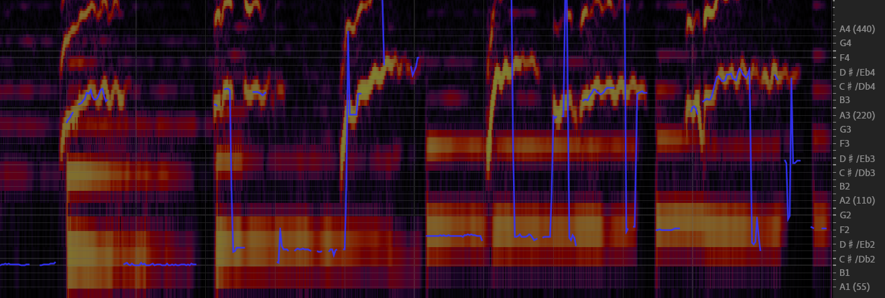

# Abstract

The Song Generation task aims to synthesize music composed of vocals and accompaniment from given lyrics. While the existing method, Jukebox, has explored this task, its constrained control over the generations often leads to deficiency in music performance. To mitigate the issue, we introduce an important concept from music composition, namely chords, to song generation networks. Chords form the foundation of accompaniment and provide vocal melody with associated harmony. Given the inaccuracy of automatic chord extractors, we devise a robust cross-attention mechanism augmented with dynamic weight sequence to integrate extracted chord information into song generations and reduce frame-level flaws, and propose a novel model termed Chord-Conditioned Song Generator (CSG) based on it. Experimental evidence demonstrates our proposed method outperforms other approaches in terms of musical performance and control precision of generated songs.

# Music Sample 
We show the songs generated by proposed CSG and other methods, conditioned by unseen lyrics and specified chords.

| Lyrics | Chords | reference chords | Jukebox | GPT-only |concatenation | cross-attention | proposed | spectrogram of proposed |
| :----: | :----: | :--------------: | :-----: | :------: | :----------: |  :------------: | :------: | :-------------------------------------------: |
| But thoughts, the fields to see and prize; Else may the silent feet. | 6-5-4-1 (A:min-G:maj-F:maj-C:maj) | <audio controls><source src="./wavs/ref chords/6541.mp3" type="audio/mp3">Your browser does not support the audio element.</audio> | <audio controls><source src="./wavs/jukebox/6541.mp3" type="audio/mp3">Your browser does not support the audio element.</audio> | <audio controls><source src="./wavs/gpt-only/6541.mp3" type="audio/mp3">Your browser does not support the audio element.</audio> | <audio controls><source src="./wavs/concatenation/6541.mp3" type="audio/mp3">Your browser does not support the audio element.</audio> | <audio controls><source src="./wavs/cross/6541.mp3" type="audio/mp3">Your browser does not support the audio element.</audio> | <audio controls><source src="./wavs/propose/6541.mp3" type="audio/mp3">Your browser does not support the audio element.</audio> |  |
| Don't you know it's gonna be alright. | 6-4-5-1 (A:min-F:maj-G:maj-C:maj) | <audio controls><source src="./wavs/ref chords/6451.mp3" type="audio/mp3">Your browser does not support the audio element.</audio> | <audio controls><source src="./wavs/jukebox/6451.mp3" type="audio/mp3">Your browser does not support the audio element.</audio> | <audio controls><source src="./wavs/gpt-only/6451.mp3" type="audio/mp3">Your browser does not support the audio element.</audio> | <audio controls><source src="./wavs/concatenation/6451.mp3" type="audio/mp3">Your browser does not support the audio element.</audio> | <audio controls><source src="./wavs/cross/6451.mp3" type="audio/mp3">Your browser does not support the audio element.</audio> | <audio controls><source src="./wavs/propose/6451.mp3" type="audio/mp3">Your browser does not support the audio element.</audio> |  |
| When I get lunch and eat my food, I hope that my model will Reason. | 1-5-6-4 (C:maj-G:maj-A:min-F:maj) | <audio controls><source src="./wavs/ref chords/1564.mp3" type="audio/mp3">Your browser does not support the audio element.</audio> | <audio controls><source src="./wavs/jukebox/1564.mp3" type="audio/mp3">Your browser does not support the audio element.</audio> | <audio controls><source src="./wavs/gpt-only/1564.mp3" type="audio/mp3">Your browser does not support the audio element.</audio> | <audio controls><source src="./wavs/concatenation/1564.mp3" type="audio/mp3">Your browser does not support the audio element.</audio> | <audio controls><source src="./wavs/cross/1564.mp3" type="audio/mp3">Your browser does not support the audio element.</audio> | <audio controls><source src="./wavs/propose/1564.mp3" type="audio/mp3">Your browser does not support the audio element.</audio> |  |
| Just as long as I am there, I'll be there in your night. | 2-6-5-1 (D:min-A:min-G:maj-C:maj) | <audio controls><source src="./wavs/ref chords/2651.mp3" type="audio/mp3">Your browser does not support the audio element.</audio> | <audio controls><source src="./wavs/jukebox/2651.mp3" type="audio/mp3">Your browser does not support the audio element.</audio> | <audio controls><source src="./wavs/gpt-only/2651.mp3" type="audio/mp3">Your browser does not support the audio element.</audio> | <audio controls><source src="./wavs/concatenation/2651.mp3" type="audio/mp3">Your browser does not support the audio element.</audio> | <audio controls><source src="./wavs/cross/2651.mp3" type="audio/mp3">Your browser does not support the audio element.</audio> | <audio controls><source src="./wavs/propose/2651.mp3" type="audio/mp3">Your browser does not support the audio element.</audio> |  |
| The darkest evening of the year. | 4-5-3-6 (F:maj-G:maj-E:min-A:min) | <audio controls><source src="./wavs/ref chords/4536.mp3" type="audio/mp3">Your browser does not support the audio element.</audio> | <audio controls><source src="./wavs/jukebox/4536.mp3" type="audio/mp3">Your browser does not support the audio element.</audio> | <audio controls><source src="./wavs/gpt-only/4536.mp3" type="audio/mp3">Your browser does not support the audio element.</audio> | <audio controls><source src="./wavs/concatenation/4536.mp3" type="audio/mp3">Your browser does not support the audio element.</audio> | <audio controls><source src="./wavs/cross/4536.mp3" type="audio/mp3">Your browser does not support the audio element.</audio> | <audio controls><source src="./wavs/propose/4536.mp3" type="audio/mp3">Your browser does not support the audio element.</audio> |  |
| Dead puppets may, move in the bright and glorious day. | 1-2-3-4 (C:maj-D:min-E:min-F:maj) | <audio controls><source src="./wavs/ref chords/1234.mp3" type="audio/mp3">Your browser does not support the audio element.</audio> | <audio controls><source src="./wavs/jukebox/1234.mp3" type="audio/mp3">Your browser does not support the audio element.</audio> | <audio controls><source src="./wavs/gpt-only/1234.mp3" type="audio/mp3">Your browser does not support the audio element.</audio> | <audio controls><source src="./wavs/concatenation/1234.mp3" type="audio/mp3">Your browser does not support the audio element.</audio> | <audio controls><source src="./wavs/cross/1234.mp3" type="audio/mp3">Your browser does not support the audio element.</audio> | <audio controls><source src="./wavs/propose/1234.mp3" type="audio/mp3">Your browser does not support the audio element.</audio> |  |

